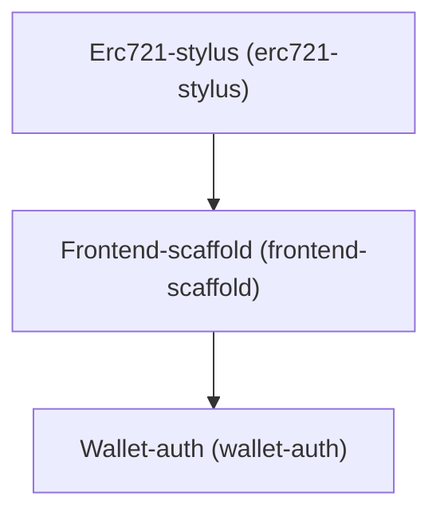

# Architecture

## Dependency Graph

```mermaid
graph TD
  3e5e841e["Erc721-stylus (erc721-stylus)"]
  5b9f8438["Frontend-scaffold (frontend-scaffold)"]
  a7e0ba36["Wallet-auth (wallet-auth)"]
  3e5e841e --> 5b9f8438
  5b9f8438 --> a7e0ba36
```

## Execution / Implementation Order

1. **Erc721-stylus** (`3e5e841e`)
2. **Frontend-scaffold** (`5b9f8438`)
3. **Wallet-auth** (`a7e0ba36`)
